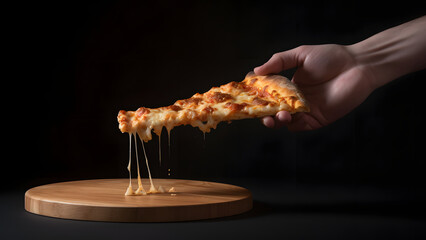

# 

  

  

## Project Description: 
In this project, I worked with a dataset containing information about pizza sales from a pizza restaurant chain. The dataset includes details such as sales transactions, pizza types, customer information, and dates. My task is to analyze this dataset using SQL queries to gain insights into the sales performance, customer preferences, and trends over time.

## Questions: 
1.Retrieve the total number of orders placed.

2.Calculate the total revenue generated from pizza sales.

3.Identify the highest-priced pizza.

4.Identify the most common pizza size ordered.

5.List the top 5 most ordered pizza types along with their quantities.

6.Join the necessary tables to find the total quantity of each pizza category ordered.

7.Determine the distribution of orders by hour of the day.

8.Join relevant tables to find the category-wise distribution of pizzas.

9.group the orders by date and calculate the average number of pizzas ordered per day.

10.Determine the top 3 most ordered pizza types based on revenue.

11.Calculate the percentage contribution of each pizza type to total revenue.

12.Analyze the cumulative revenue generated over time.

13.Determine the top 3 most ordered pizza types based on revenue for each pizza category.

## Project Schema :

### 🔥 Hot Metrics:
Total Orders: A whopping 21,350 orders served up to our hungry customers! 🛒
Total Revenue: A healthy cash flow of $817,860. 💵
Highest Priced Pizza: Introducing The Greek Pizza—our luxury choice! 🇬🇷
Daily Orders Average: 138 orders a day keep the kitchen busy! 🔥

### 🍕 Pizza Types by the Numbers:
Classic Appeal: 27% of total revenue comes from the ever-popular Classic pizzas. 🍕
Supreme Satisfaction: The Supreme type isn't far behind, contributing 26% to total revenue. 🥇
Chicken Craze: Chicken pizzas are beloved by many, making up 24% of sales. 🐔
Veggie Victory: Vegetarians rejoice! Veggie pizzas account for 23% of revenue. 🥦

### 💡 Deeper Insights:
Most Popular Pizza Size: Keep an eye on what size is selling the most to streamline your kitchen processes.
Top 5 Pizza Types: Discover the customer favorites and consider promoting these for maximum impact.
Hourly Order Breakdown: Adjust staff schedules based on the peak ordering times to ensure efficiency.
Pizza Category Breakdown: See which pizza categories drive the most sales and capitalize on them.
Pizzas per Day: Observe patterns in daily ordering to manage inventory and staff effectively.

### 🚀 Actionable Insights:
Optimize Menu Offerings: Adjust your menu based on revenue-generating pizza types.
Boost Peak Performance: Use hourly breakdowns to optimize staffing and delivery schedules.
Promote Top Pizzas: Drive sales by promoting customer favorites.
Monitor Trends: Keep an eye on ordering trends to adapt your strategy as needed.

Certainly! Here's a sample conclusion for the pizza sales analysis project:

## Conclusion:

Through my comprehensive analysis of the pizza sales dataset, I have gained valuable insights into the performance of the pizza restaurant chain, customer preferences, and trends over time. Here are the key findings and conclusions drawn from my analysis:

Top-selling Pizzas:

By analyzing sales data, I identified the top-selling pizzas, which include classics like Margherita and Pepperoni, as well as specialty options like BBQ Chicken and Vegetarian Supreme. Understanding the popularity of these pizzas can guide inventory management and promotional efforts.

Peak Sales Periods: 

Time series analysis revealed peak sales periods, such as weekends and evenings, indicating when the restaurant experiences the highest demand. This insight can inform staffing schedules and resource allocation to ensure efficient operations during busy times.

Customer Demographics:

Exploring customer data provided insights into demographics, ordering behavior, and loyalty program participation. Understanding customer preferences can help tailor marketing campaigns and menu offerings to better cater to their needs.

Geographical Variations: 

While my analysis did not reveal significant geographical variations in pizza preferences, further investigation into regional differences may be warranted to optimize marketing strategies and menu offerings for specific locations.

Recommendations:

Based on my analysis, I recommend the following actions to the restaurant chain:

Implement targeted marketing campaigns based on customer demographics and ordering patterns.
Introduce promotional offers or menu specials during peak sales periods to capitalize on increased demand.
Enhance customer engagement through loyalty programs or personalized offers to foster repeat business.
Monitor and analyze regional sales data to identify opportunities for localized marketing efforts or menu adjustments.

  

## Project Link:

[Click Here](https://github.com/subhasish9ghosh5/pizza-sales/blob/main/PIZZA%20SALES.pdf)

## Auther:
Subhasish Ghosh - Data Analyst
Subhasish Ghosh - All Work
