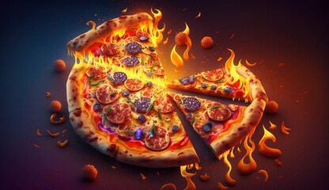

# pizza-sales

  

## Project Description: 
In this project, I worked with a dataset containing information about pizza sales from a pizza restaurant chain. The dataset includes details such as sales transactions, pizza types, customer information, and dates. My task is to analyze this dataset using SQL queries to gain insights into the sales performance, customer preferences, and trends over time.

## Questions: 
1.Retrieve the total number of orders placed.

2.Calculate the total revenue generated from pizza sales.

3.Identify the highest-priced pizza.

4.Identify the most common pizza size ordered.

5.List the top 5 most ordered pizza types along with their quantities.

6.Join the necessary tables to find the total quantity of each pizza category ordered.

7.Determine the distribution of orders by hour of the day.

8.Join relevant tables to find the category-wise distribution of pizzas.

9.group the orders by date and calculate the average number of pizzas ordered per day.

10.Determine the top 3 most ordered pizza types based on revenue.

11.Calculate the percentage contribution of each pizza type to total revenue.

12.Analyze the cumulative revenue generated over time.

13.Determine the top 3 most ordered pizza types based on revenue for each pizza category.

## Project Schema :

### 🔥 Hot Metrics:
Total Orders: A whopping 21,350 orders served up to our hungry customers! 🛒
Total Revenue: A healthy cash flow of $817,860. 💵
Highest Priced Pizza: Introducing The Greek Pizza—our luxury choice! 🇬🇷
Daily Orders Average: 138 orders a day keep the kitchen busy! 🔥

### 🍕 Pizza Types by the Numbers:
Classic Appeal: 27% of total revenue comes from the ever-popular Classic pizzas. 🍕
Supreme Satisfaction: The Supreme type isn't far behind, contributing 26% to total revenue. 🥇
Chicken Craze: Chicken pizzas are beloved by many, making up 24% of sales. 🐔
Veggie Victory: Vegetarians rejoice! Veggie pizzas account for 23% of revenue. 🥦

### 💡 Deeper Insights:
Most Popular Pizza Size: Keep an eye on what size is selling the most to streamline your kitchen processes.
Top 5 Pizza Types: Discover the customer favorites and consider promoting these for maximum impact.
Hourly Order Breakdown: Adjust staff schedules based on the peak ordering times to ensure efficiency.
Pizza Category Breakdown: See which pizza categories drive the most sales and capitalize on them.
Pizzas per Day: Observe patterns in daily ordering to manage inventory and staff effectively.

### 🚀 Actionable Insights:
Optimize Menu Offerings: Adjust your menu based on revenue-generating pizza types.
Boost Peak Performance: Use hourly breakdowns to optimize staffing and delivery schedules.
Promote Top Pizzas: Drive sales by promoting customer favorites.
Monitor Trends: Keep an eye on ordering trends to adapt your strategy as needed.
